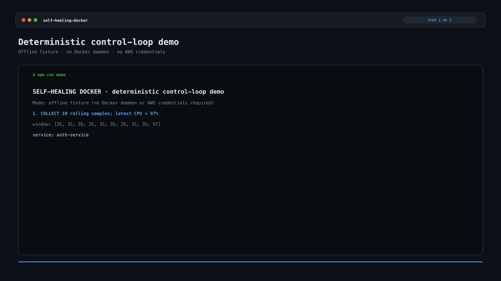
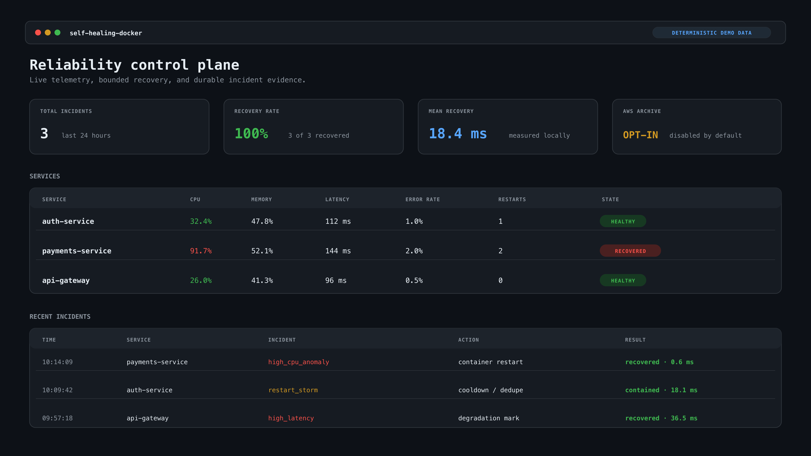
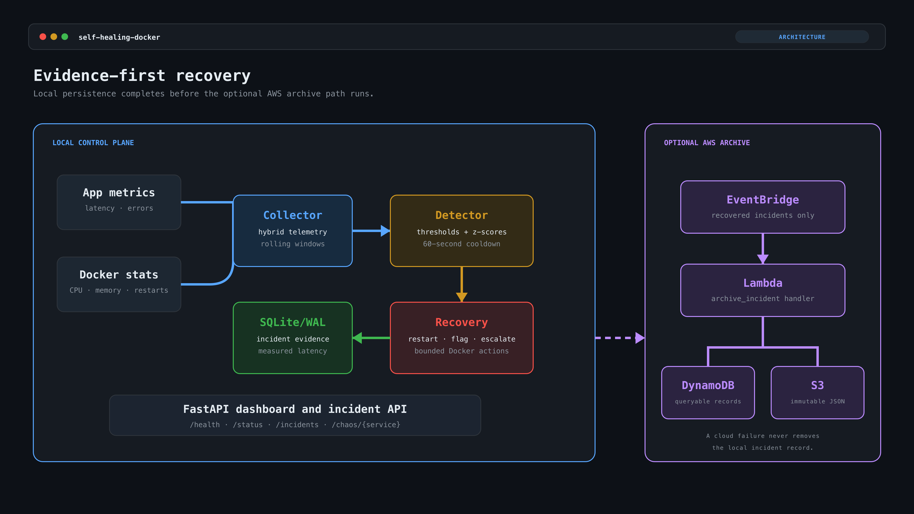

<h1 align="center">Self-Healing Docker</h1>

<p align="center"><strong>Detect container failures. Recover automatically. Keep the evidence.</strong></p>

<p align="center">
  <a href="https://github.com/Myst1C13/Self-Healing-Docker/actions/workflows/verify.yml"></a>
  
  
  
</p>

Self-Healing Docker is a reliability control plane for a local microservice stack. It collects application and Docker Engine telemetry, detects threshold and rolling z-score anomalies, runs bounded recovery actions, and stores each incident with measured recovery latency.

The system works locally by default. An optional AWS path sends recovered incidents through EventBridge and Lambda, then archives them in DynamoDB and S3.

## Demo

```bash
git clone https://github.com/Myst1C13/Self-Healing-Docker.git
cd Self-Healing-Docker
python3 -m venv venv
source venv/bin/activate
pip install -r requirements.txt
npm run demo
```

`npm run demo` runs a deterministic collect, detect, recover, persist, and report cycle. It uses the real detector, recovery adapter, and SQLite store with an in-process container fixture. It does not require Docker or AWS credentials.



## Dashboard

The live control plane shows current service telemetry, restart counts, incident history, recovery status, and measured latency. The screenshot below uses fictional demo data.



## Architecture



Local persistence completes before cloud export. If AWS is unavailable, the local incident record remains intact and records whether export succeeded or failed.

## What is implemented

| Area | Implementation |
| --- | --- |
| Telemetry | Docker CPU delta, working-set memory, restart count, HTTP latency, and error rate |
| Detection | Critical thresholds and rolling z-scores |
| Recovery | Container restart, degradation marking, leak flagging, and escalation |
| Safety | Per-service and incident-type cooldowns prevent recovery storms |
| Persistence | Thread-safe SQLite with WAL, indexes, and bounded queries |
| API | FastAPI health, status, incident, and chaos routes |
| AWS | EventBridge to Lambda to DynamoDB and encrypted, versioned S3 |
| Verification | 23 pytest tests and GitHub Actions |

## Live Docker demo

Requirements: Python 3.12+, Docker Engine or Docker Desktop, and Docker Compose.

```bash
# terminal 1
docker compose up --build -d

# terminal 2
source venv/bin/activate
uvicorn src.api:app --reload

# terminal 3
npm run demo:live
```

Open [http://localhost:8000](http://localhost:8000). Use the `chaos` action beside a service to inject a controlled failure. The pipeline collects the changed signals, creates an incident, runs the mapped recovery action, and saves the result.

```bash
docker compose down
```

## Detection and recovery

CPU, memory, latency, and error-rate incidents fire when the latest sample crosses a critical threshold or exceeds 2.5 standard deviations from its rolling mean. Restart storms use a direct count threshold. Duplicate service and incident-type pairs are suppressed for 60 seconds.

Telemetry has three modes:

| `METRICS_SOURCE` | Behavior |
| --- | --- |
| `hybrid` | Prefer Docker CPU, memory, and restart telemetry; fall back to service metrics |
| `docker` | Use Docker telemetry and surface collection failures |
| `service` | Use only the application metrics endpoint |

## AWS incident archive

The AWS stack is opt-in. The default demo creates no cloud resources and makes no AWS calls.

The SAM template provisions:

- a custom EventBridge bus and rule;
- a Python Lambda archive handler;
- an on-demand encrypted DynamoDB table with point-in-time recovery;
- a private, encrypted, versioned S3 bucket;
- a least-privilege policy for `events:PutEvents`.

Deployment and teardown instructions are in [docs/AWS.md](docs/AWS.md).

## API

| Route | Purpose |
| --- | --- |
| `GET /health` | Control-plane health |
| `GET /status` | Latest service snapshots and recovery statistics |
| `GET /incidents` | Filterable persisted incident history |
| `POST /chaos/{service}` | Controlled failure injection for the demo stack |
| `GET /` | Live dashboard |

## Verify

```bash
npm run verify
```

The 23 tests cover anomaly detection, Docker metric calculations, telemetry fallback, restart recovery, cooldowns, SQLite persistence, EventBridge publishing, and the Lambda DynamoDB/S3 archive path.

## Repository map

```text
src/                 collector, detector, recovery, pipeline, API, storage
services/            three instrumented FastAPI demo services
infra/aws/           SAM template and Lambda archive handler
scripts/             deterministic and live demos
tests/               unit and component tests
docs/AWS.md           AWS deployment and teardown
docker-compose.yml   local microservice topology
```

## Current limits

- Recovery policies are static mappings, not learned policies.
- Container restart is implemented; Kubernetes remediation is not.
- AWS export is best-effort after a durable local write and has no retry queue or dead-letter queue yet.
- The live demo uses instrumented services and controlled chaos injection; it is not a production-scale benchmark.

## Stack

Python, FastAPI, Docker SDK, SQLite/WAL, NumPy, pytest, Docker Compose, EventBridge, Lambda, DynamoDB, S3, and AWS SAM.
